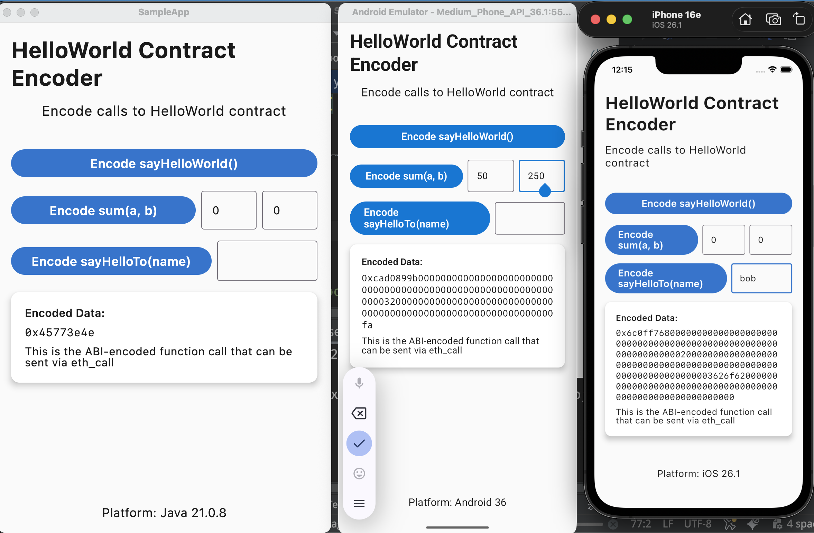

# SwissETH Solidity

Type-safe Kotlin Multiplatform wrappers for Solidity ABI encoding and decoding.

A refreshed KMP fork of [Safe's Bivrost](https://github.com/5afe/bivrost-kotlin).

## Overview
SwissETH Solidity allows you to:

- Generate type-safe Kotlin wrappers from Solidity ABI
- Encode / decode smart contract calls
- Use the same API across `Android` / `iOS` / `JVM`

Solidity:
```solidity
contract HelloWorld {
    function sayHelloWorld() public pure returns (string memory) {
        return "Hello World";
    }

    function sum(uint256 a, uint256 b) public pure returns (uint256) {
        return a + b;
    }

    function sayHelloTo(string memory name) public pure returns (string memory) {
        return string(abi.encodePacked("Hello ", name));
    }
}
```

Kotlin:
```kotlin
val helloWorldEncoded = HelloWorld.SayHelloWorld.encode()

val sumEncoded = HelloWorld.Sum.encode(
    a = Solidity.UInt256(10.toBigInteger()),
    b = Solidity.UInt256(5.toBigInteger()),
)

val sayHelloToEncoded = HelloWorld.SayHelloTo.encode(
    name = Solidity.String("Bob")
)
```

This library does not perform RPC calls - it only generates wrapper classes and encodes contract interactions.
The encoded data can be easily passed as `String` to any Ethereum client.

## Setup

### 1. Add repositories

In your `settings.gradle.kts`, add GitHub Packages repository with credentials to both `pluginManagement` and `dependencyResolutionManagement`:

```kotlin
pluginManagement {
    repositories {
        // ..other repos       
        maven {
            url = uri("https://maven.pkg.github.com/alexandr7035/swisseth-kotlin-multiplatform")
            // credentials with access to read packages
            credentials {
                username = "github user"
                password = "github token"
            }
        }
    }
}

dependencyResolutionManagement {
    repositories {
        // ..other repos       
        maven {
            url = uri("https://maven.pkg.github.com/alexandr7035/swisseth-kotlin-multiplatform")
            // credentials with access to read packages
            credentials {
                username = "github user"
                password = "github token"
            }
        }
    }
}
```
> ⚠️ GitHub Packages requires authentication even for public packages

For local development, you can use `mavenLocal()` instead (publish with `./gradlew publishToMavenLocal`).

### 2. Configure version catalog

In your `libs.versions.toml`, add:

```toml
[versions]
swisseth = "0.1"

[libraries]
swisseth-solidity-types = { module = "io.swisseth:swisseth-solidity-types", version.ref = "swisseth"}

[plugins]
swisseth-solidity-types = { id = "io.swisseth.solidity.types", version.ref = "swisseth"}
```

### 3. Apply plugin and add dependency

In your module's `build.gradle.kts`:

```kotlin
plugins {
    // ... other plugins
    // Add plugin
    alias(libs.plugins.swisseth.solidity.types)  
}

// Configure package for generated contract wrappers
solidityTypes {
    packageName.set("com.example.contracts")
}

kotlin {
    sourceSets {
        commonMain.dependencies {
            // Add dependency
            implementation(libs.swisseth.solidity.types)  
        }
    }
}
```

### 4. Add ABI files

Place your Solidity ABI JSON files in the `{module}/abi/` directory. Each ABI file must contain a `contractName` field and an `abi` array.

Example file structure:
```
your-module/
  ├── abi/
  │   ├── HelloWorld.json
  │   └── MyContract.json
  ├── src/
  └── build.gradle.kts
```

Example ABI file structure:
```json
{
  "contractName": "MyContractWrapperClassName",
  "abi": [
    {
      "inputs": [...],
      "name": "sayHelloWorld",
      "outputs": [...],
      "stateMutability": "pure",
      "type": "function"
    }
  ]
}
```

### 5. Build your project

The plugin will automatically generate Kotlin wrapper classes during the build process. Generated code will be available in `build/generated/source/abi/commonMain`.
You can also run the generation manually:

```bash
./gradlew :your-module:generateAbiWrapper
```

## Usage

After building your project, the plugin generates Kotlin wrapper classes for your contracts. Here's a complete example:

```kotlin
import io.swisseth.solidity.model.Solidity
import org.example.project.contracts.HelloWorld
import com.ionspin.kotlin.bignum.integer.toBigInteger

// Encode sum(a, b) call
val data = HelloWorld.Sum.encode(
    a = Solidity.UInt256(10.toBigInteger()),
    b = Solidity.UInt256(5.toBigInteger())
)

// Pass encoded data to any third-party ethereum client
ethClient.ethCall(
    to = "contract address",
    data = data
)
```

## Sample app
Open `SampleApp` directory as a separate project to run the app or check the sources.

<p>

</p>

## License
Licensed under the **Apache License 2.0**, same as the [original](https://github.com/5afe/bivrost-kotlin) project. See [LICENSE](LICENSE) file for details.
